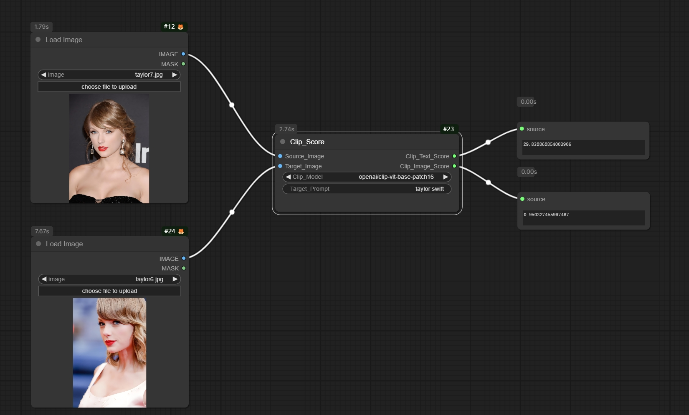

# ComfyUI Image Evaluation Node

This repository contains an extension to [ComfyUI](https://github.com/comfyanonymous/ComfyUI)

This node allows you to evaluate the Clip Score between two images or a image and a text prompt using the CLIP model and DINO Score between two images using the DINO model.

## Installation
- Clone this repository into the `custom_nodes` folder of ComfyUI. 
```
cd ComfyUI-Image-Evaluation
```
- Install the requirements.
```
pip install -r requirements.txt
```
- Restart ComfyUI and the extension should be loaded.

## Features

- **Clip Text Score**: Evaluate the Clip Score between two images or a image and a text prompt using the CLIP model.
- **Clip Image Score**: Evaluate the Clip Score between a image and a target image using the CLIP model.
- **Dino Score**: Evaluate the DINO Score between two images using the DINO model.

## Nodes

## Author
- Yujia Wu
- GitHub: [wu12023](https://github.com/wu12023)
